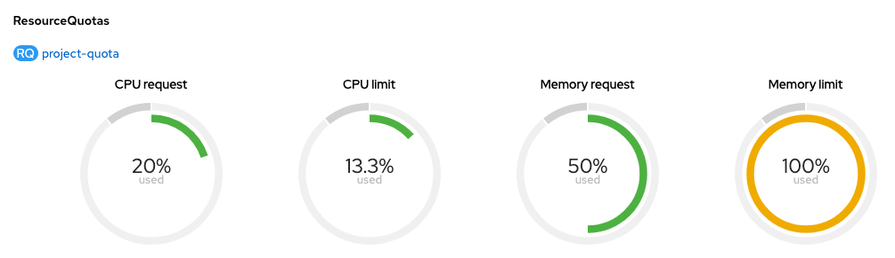
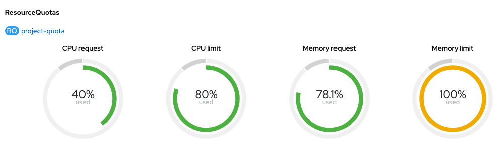
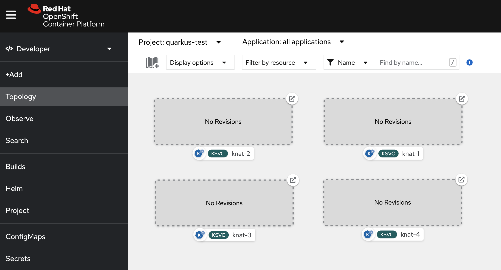

# Quarkus Knative Performance in OpenShift

> Create a project named `quarkus-test`.

> Create required images in `quarkus-test` namespace using the instructions in `weather-rest/README.md` (section: Run in OpenShift).

> Install OpenShift Serverless Operator and create a Knative serving instance.

## JVM

Deploy a microserive:

```sh
# Create app
oc new-app app-jvm -n quarkus-test

# Expose service
oc expose svc app-jvm -n quarkus-test

# Validate service is working (wait for pod to be ready)
APP_HOST=$(oc get route app-jvm -o template --template='{{.spec.host}}' -n quarkus-test)
curl http://$APP_HOST/weather/madrid
```

Review consuption:

```sh
> oc adm top pods -n quarkus-test

NAME                       CPU(cores)   MEMORY(bytes)
app-jvm-57f4bf7c48-k9zl7   0m           140Mi
```

Delete app:

```sh
oc delete all -l app=app-jvm -n quarkus-test
```

Create resources quotas for current project:

```sh
# Create project quotas
cat <<EOF | oc apply -n quarkus-test -f -
apiVersion: v1
kind: ResourceQuota
metadata:
  name: project-quota
spec:
  hard:
    pods: "10"
    requests.cpu: "2"
    requests.memory: 1Gi
    limits.cpu: "6"
    limits.memory: 1Gi
EOF
```

Deploy four applications with limits and resources patched:

```sh
# Deploy apps 
for i in `seq 1 4`; do \ 
  oc new-app app-jvm --name jvm-$i -n quarkus-test && \
  oc expose svc jvm-$i -n quarkus-test && \
  oc patch deploy jvm-$i -p '{"spec": {"template": {"spec": {"containers": [{"name": "app-jvm", "resources": { "limits":{ "cpu": "200m", "memory": "256Mi"}, "requests": { "cpu": "100m", "memory": "128Mi"}}}]}}}}' -n quarkus-test ; done
```

Review resource quota in project:

```sh
> oc describe quota project-quota -n quarkus-test

Name:            project-quota
Namespace:       quarkus-test
Resource         Used   Hard
--------         ----   ----
limits.cpu       800m   6
limits.memory    1Gi    1Gi
pods             4      10
requests.cpu     400m   2
requests.memory  512Mi  1Gi
```

In OCP console:



:white_check_mark: All four services are running successfully

:white_check_mark: Memory limit is 100% allocated

Clean up:

```sh
# Delete apps
for i in `seq 1 4`; do oc delete all -l app=jvm-$i -n quarkus-test; done

# Delete namespace quotas
oc delete resourcequota project-quota -n quarkus-test
```

## NATIVE

```sh
# Create app
oc new-app app-nat -n quarkus-test

# Expose service
oc expose svc app-nat -n quarkus-test

# Validate service is working (wait for pod to be ready)
APP_HOST=$(oc get route app-nat -o template --template='{{.spec.host}}' -n quarkus-test)
curl http://$APP_HOST/weather/madrid
```

Review consuption:

```sh
> oc adm top pods -n quarkus-test

NAME                       CPU(cores)   MEMORY(bytes)
app-nat-77dcdc4d57-8l2bd   0m           18Mi
```

Delete app:

```sh
oc delete all -l app=app-nat -n quarkus-test
```

Create resources quotas for current project:

```sh
# Create project quotas
cat <<EOF | oc apply -f -
apiVersion: v1
kind: ResourceQuota
metadata:
  name: project-quota
spec:
  hard:
    pods: "10"
    requests.cpu: "500m"
    requests.memory: 256Mi
    limits.cpu: "1"
    limits.memory: 512Mi
EOF
```

Deploy four applications with limits and resources patched:

```sh
# Deploy apps 
for i in `seq 1 4`; do \ 
  oc new-app app-nat --name nat-$i -n quarkus-test && \
  oc expose svc nat-$i -n quarkus-test && \
  oc patch deploy nat-$i -p '{"spec": {"template": {"spec": {"containers": [{"name": "app-nat", "resources": { "limits":{ "cpu": "200m", "memory": "128Mi"}, "requests": { "cpu": "50m", "memory": "50Mi"}}}]}}}}' -n quarkus-test ; done
```

Review resource quota in project:

```sh
> oc describe quota project-quota -n quarkus-test

Name:            project-quota
Namespace:       quarkus-test
Resource         Used   Hard
--------         ----   ----
limits.cpu       800m   1
limits.memory    512Mi  512Mi
pods             4      10
requests.cpu     200m   500m
requests.memory  200Mi  256Mi
```

In OCP console:



:white_check_mark: All four services are running successfully

:white_check_mark: Memory limit is 100% allocated

Clean up:

```sh
# Delete apps
for i in `seq 1 4`; do oc delete all -l app=nat-$i -n quarkus-test; done
```

## KNATIVE (Serverless)

Deploy nat-app image as a serverless KNative application.

We keep the same resource quotas and container resources we used for native application deployment. 

We should be able to run 4 pods as in native deployment.

> Following commands asume you're in demos/knative-resources/ directory.

Deploy knative applications:

```sh
# Deploy apps 
for i in `seq 1 4`; do \ 
  oc process -f files/knative-app-template.yaml -p APP_NAMESPACE=quarkus-test -p APP_NAME=knat-$i | oc apply -n quarkus-test -f - ; done
```

:x: Applications cannot start due to not enough resources:



```sh
> oc get events

...
5m          Warning   FailedCreate                   replicaset/nat-1-75d4f59f87                     Error creating: pods "nat-1-75d4f59f87-z7xb5" is forbidden: exceeded quota: project-quota, requested: limits.memory=1536Mi,requests.memory=256Mi, used: limits.memory=128Mi,requests.memory=50Mi, limited: limits.memory=512Mi,requests.memory=256Mi
...
```

Comparing configured requests and limits in `files/knative-app-template.yaml` we can see huge difference:

| | Configured | Applied | Difference |
|---|---|---| --- |
| requests.cpu |  50m | 75m | 25m |
| requests.memory |  50Mi | 306Mi | 256Mi |
| limits.cpu |  200m | 700m | 500m |
| limits.memory |  128Mi | 1664Mi | 1536Mi |

:question: Where is that difference comming from?

If we review knative service pod:

```sh
> oc describe pod knat-1-00001-deployment-576dfbb577-522ff

...
Containers:
  knat-1:
    ...
    Limits:
      cpu:     200m
      memory:  128Mi
    Requests:
      cpu:     50m
      memory:  50Mi
    ...
  queue-proxy:
    ...
    Limits:
      cpu:     500m
      memory:  1536Mi
    Requests:
      cpu:      25m
      memory:   256Mi
...
```

The queue-proxy sidecar container is the one adding request and limit values into our namespace.

The sidecar container is injected by the knative-serving instance and if there are no values for request and limits the sidecar container use the namespace default values.

There are two ways to modify this behaviour, using annotations or configuring knative-serving deployment.

### Use `queue.sidecar.serving.knative.dev/resourcePercentage`

With this label we indicate the percentage of application container request and limit that we want to apply into the sidecar.

For example:

```sh
# Remove existing quotas to allow services to start
oc delete resourcequota project-quota -n quarkus-test

# Add label to all deployments (reducing to 10%)
for i in `seq 1 4`; do kn service update knat-$i -a queue.sidecar.serving.knative.dev/resourcePercentage="10" -n quarkus-test; done
```

After some tests these are the results:

<table class="tg">
<thead>
  <tr><th class="tg-amwm">Scenario 1</th><th class="tg-amwm">requests.cpu</th><th class="tg-amwm">limits.cpu</th><th class="tg-amwm">requests.memory</th><th class="tg-amwm">limits.memory</th><th class="tg-amwm">notes</th></tr>
</thead>
<tbody>
  <tr><td class="tg-baqh">Namespace Default</td><td class="tg-lqy6">50m</td><td class="tg-lqy6">500m</td><td class="tg-lqy6">256Mi</td><td class="tg-lqy6">1536Mi</td><td class="tg-8zwo"></td></tr>
  <tr><td class="tg-baqh">Application v1</td><td class="tg-lqy6">50m</td><td class="tg-lqy6">200m</td><td class="tg-lqy6">50Mi</td><td class="tg-lqy6">128Mi</td><td class="tg-8zwo"></td></tr>
  <tr><td class="tg-baqh" colspan="6">queue-proxy requests and limits values</td></tr>
  <tr><td class="tg-baqh">No configuration</td><td class="tg-lqy6">50m</td><td class="tg-lqy6">500m</td><td class="tg-lqy6">256Mi</td><td class="tg-lqy6">1536Mi</td><td class="tg-8zwo">Sidecar uses the namespace defaults</td></tr>
  <tr><td class="tg-baqh">Annotation with 50%</td><td class="tg-lqy6">25m</td><td class="tg-lqy6">100m</td><td class="tg-lqy6">50Mi</td><td class="tg-lqy6">200Mi</td><td class="tg-8zwo">Memory values are not reduced (minimum value)</td></tr>
  <tr><td class="tg-baqh">Annotation with 75%</td><td class="tg-lqy6">37m</td><td class="tg-lqy6">150m</td><td class="tg-lqy6">50Mi</td><td class="tg-lqy6">200Mi</td><td class="tg-8zwo"><span style="font-weight:400;font-style:normal">Memory values are not reduced (minimum value)</span></td></tr>
  <tr><td class="tg-amwm">Scenario 2</td><td class="tg-amwm">requests.cpu</td><td class="tg-amwm">limits.cpu</td><td class="tg-amwm">requests.memory</td><td class="tg-amwm">limits.memory</td><td class="tg-amwm">notes</td></tr>
  <tr><td class="tg-baqh">Application v2</td><td class="tg-lqy6">50m</td><td class="tg-lqy6">200Mi</td><td class="tg-lqy6">200Mi</td><td class="tg-lqy6">500Mi</td><td class="tg-0lax"></td></tr>
  <tr><td class="tg-baqh" colspan="6">queue-proxy requests and limits values</td></tr>
  <tr><td class="tg-baqh">Annotation with 75%</td><td class="tg-lqy6">37m</td><td class="tg-lqy6">150m</td><td class="tg-lqy6">150Mi</td><td class="tg-lqy6">375Mi</td><td class="tg-8zwo">Memory values are reduced as expected</td></tr>
</tbody>
</table>

### knative-serving configuration 

[official documentation](https://knative.dev/docs/serving/configuration/deployment/)

*First let's cleanup previous deployments and configurations:*

```sh
# Remove existing quotas 
oc delete resourcequota project-quota -n quarkus-test

# Delete apps
for i in `seq 1 4`; do kn service delete knat-$i -n quarkus-test; done
```

Modify knative-serving configuration map:

- Using Console: Go to > Workloads > ConfigMaps > select knative-service namespace > config-deployment. Modify the following properties:
```yaml
kind: ConfigMap
apiVersion: v1
metadata:
  ...
  name: config-deployment
  namespace: knative-serving
  ...
data:
  ...
  queue-sidecar-cpu-limit: 100m
  queue-sidecar-cpu-request: 25m
  queue-sidecar-memory-limit: 200Mi
  queue-sidecar-memory-request: 50Mi
  ...
```

- Using Terminal:

  ```sh
  # Open knative-service configuration map in edit mode
  oc edit configmap -n knative-serving config-deployment -o yaml

  # Add the following values in data section
  queue-sidecar-cpu-limit: 100m
  queue-sidecar-cpu-request: 25m
  queue-sidecar-memory-limit: 200Mi
  queue-sidecar-memory-request: 50Mi

  # Save changes
  ```

In order to validate the new configuration deploy one application:

```sh
# Deploy using template
oc process -f files/knative-app-template.yaml -p APP_NAMESPACE=quarkus-test -p APP_NAME=knat-1 | oc apply -n quarkus-test -f -
```

And validate the configuration:

```sh
> oc describe pod knat-1-00001-deployment-685fc857c5-b7t76

Name:         knat-1-00001-deployment-685fc857c5-b7t76
Namespace:    quarkus-test
...
Containers:
  knat-1:
    ...
    Limits:
      cpu:     200m
      memory:  128Mi
    Requests:
      cpu:     50m
      memory:  50Mi
    ...
  queue-proxy:
    ...
    Limits:
      cpu:     100m
      memory:  200Mi
    Requests:
      cpu:      25m
      memory:   50Mi
...
```